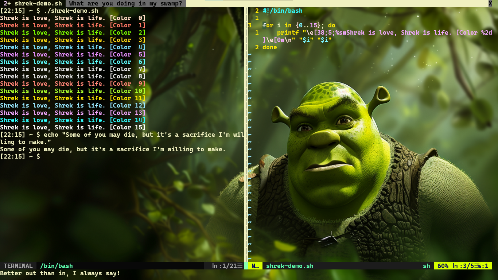
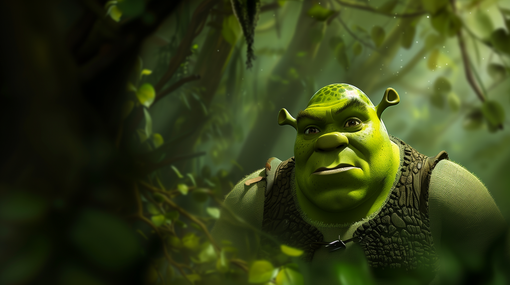

# Shrek



## Settings

```json
{
    "adjustIndistinguishableColors": "always",
    "backgroundImage": "ms-appdata:///roaming/shrek.png",
    "backgroundImageStretchMode": "fill",
    "colorScheme": "ShrekIntense",
    "cursorShape": "emptyBox",
    "experimental.retroTerminalEffect": true,
    "font": 
    {
        "face": "Cascadia Code",
        "weight": "bold"
    },
    "intenseTextStyle": "none",
    "padding": "57",
    "scrollbarState": "visible",
    "useAcrylic": true
}
```

## Fonts

n/a

## Background



## Color Scheme

```json
{
	"background": "#475347",
	"black": "#472D1A",
	"blue": "#3399FF",
	"brightBlack": "#3A5F3A",
	"brightBlue": "#66B2FF",
	"brightCyan": "#33FFFF",
	"brightGreen": "#ADFF2F",
	"brightPurple": "#B266FF",
	"brightRed": "#FF3333",
	"brightWhite": "#FFFFFF",
	"brightYellow": "#FFEA00",
	"cursorColor": "#3A5F3A",
	"cyan": "#00CCCC",
	"foreground": "#F0F0C0",
	"green": "#7FFF00",
	"name": "ShrekIntense",
	"purple": "#9933FF",
	"red": "#FF1212",
	"selectionBackground": "#3A5F3A",
	"white": "#FFFFE0",
	"yellow": "#FFD700"
}
```
